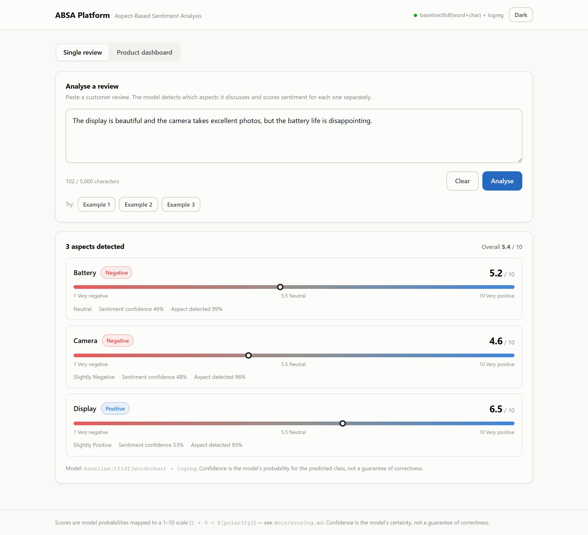
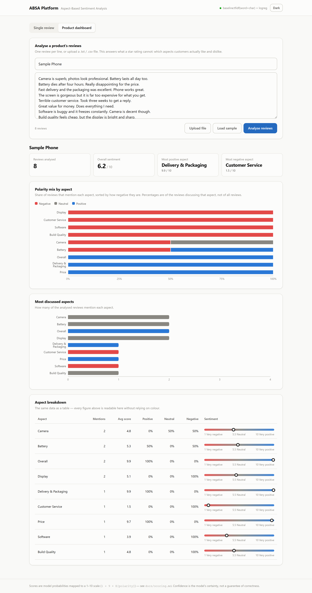
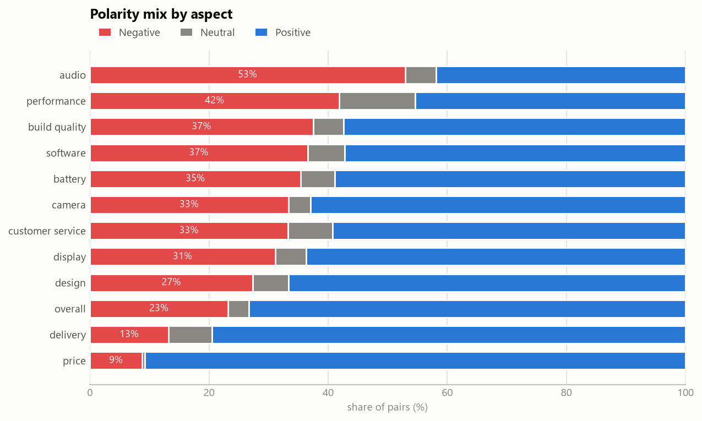

# ABSA Platform — Aspect-Based Sentiment Analysis for Product Reviews

A full-stack NLP application that reads a customer review and reports **what the
reviewer thought about each individual aspect** — camera, battery, display, price,
delivery — rather than collapsing everything into one star rating.

> *"The display is beautiful and the camera takes excellent photos, but the
> battery life is disappointing."*
>
> | Aspect | Sentiment | Score | Confidence |
> |---|---|---|---|
> | Display | Positive | 6.5 / 10 | 53% |
> | Camera | Negative | 4.6 / 10 | 48% |
> | Battery | Negative | 5.2 / 10 | 46% |
>
> Real output from the shipped baseline — **including the mistake**. Camera should
> be positive. See [the diagnostic](#the-diagnostic-that-actually-matters) for why
> a bag-of-words model fails on mixed reviews, and what fixes it.

A 4.5-star phone can have a superb camera and a battery everyone hates. The star
rating hides that; this does not.

**Stack** — Python · scikit-learn · PyTorch/Transformers · FastAPI · React · TypeScript · Vite · Recharts · Docker

---

## Contents

- [What it does](#what-it-does)
- [Results](#results)
- [The 99% story](#the-99-story)
- [Dataset](#dataset)
- [Approach](#approach)
- [Architecture](#architecture)
- [Running it](#running-it)
- [Training](#training)
- [Testing](#testing)
- [Limitations](#limitations)
- [Roadmap](#roadmap)

---

## What it does

**Single review** — paste a review, get every aspect it discusses with a polarity,
a 1–10 score, and two separate confidence figures (was the aspect mentioned; how
sure is the sentiment).



**Product dashboard** — paste or upload hundreds of reviews and get an aggregate
per aspect: what customers like, what they complain about, and how often each
comes up. This is the feature a star rating cannot provide.



Every chart is repeated as a table, so no figure depends on colour alone. Dark
mode is a selected palette for the dark surface, not an inversion
([dark](docs/screenshots/single-review-dark.png) ·
[dashboard](docs/screenshots/dashboard-dark.png)).

Screenshots are generated by `python scripts/capture_screenshots.py`, so they
always show real model output and can be regenerated after any UI change.

---

## Results

All figures are on the **held-out test split**, touched once. Splits are grouped
by review and leakage-asserted — see [Dataset](#dataset).

### Stage A — Aspect detection (multi-label, 12 aspects)

| Model | Micro F1 | Macro F1 | Subset acc | Precision | Recall |
|---|---:|---:|---:|---:|---:|
| TF-IDF + One-vs-Rest LogReg | **0.7755** | 0.7387 | 0.5523 | 0.783 | 0.768 |

### Stage B — Sentiment (3 classes)

| Model | **Macro F1** | Accuracy | neg F1 | neu F1 | pos F1 |
|---|---:|---:|---:|---:|---:|
| TF-IDF + LogReg | **0.6088** | 0.7869 | 0.720 | 0.244 | 0.863 |
| TF-IDF + LinearSVC | 0.5319 | **0.8169** | 0.712 | **0.000** | 0.884 |

**Read those last two rows together.** The SVM has *higher accuracy* and is the
worse model: it never predicts `neutral` even once. `neutral` is 5.3% of the
data, so refusing to predict it costs almost nothing in accuracy and destroys a
third of the label space.

That is why **macro F1 selects the model here, and accuracy never does.**

### The diagnostic that actually matters

Overall metrics hide whether the model conditions on the aspect at all. Most
reviews are uniformly positive or negative, so a model that reads only the
overall tone still scores respectably.

Sliced to **mixed reviews** — those carrying different polarities for different
aspects, which is the entire point of ABSA:

| Model | Mixed acc | Uniform acc | Gap | Collapsed |
|---|---:|---:|---:|---:|
| TF-IDF + LogReg | **0.5451** | 0.8404 | +0.2953 | **0.7553** |

*Collapsed* = share of mixed reviews given one single polarity for every aspect,
i.e. the aspect was ignored entirely.

So the baseline's headline 0.787 accuracy conceals that on the hard case it is
barely better than chance, and **three times out of four it ignores the aspect
completely**. A bag of words cannot tell which clause belongs to which aspect —
which is precisely the argument for the transformer stage.

Reproduce with `python scripts/compare_models.py`.

---

## The 99% story

The college project this rebuilds reported **~99% accuracy**. That number was not
reproduced here, and should not have been trusted.

Its pipeline classified *aspects* with TF-IDF + SVC, where the word "battery"
essentially determines `aspect = Battery` — a near-deterministic lookup, not a
learning problem. Sentiment came from a WordNet lexicon that was never evaluated
as a model at all.

This rebuild reports genuine numbers in the 60–78 range, with the failure modes
measured and documented. The engineering that produced the lower number —
grouped splitting, leakage assertions, macro F1, the mixed-review diagnostic — is
the actual content of the project.

---

## Dataset

**[M-ABSA](https://github.com/swaggy66/M-ABSA)** (Wu et al., [EMNLP 2025](https://aclanthology.org/2025.emnlp-main.128/)),
English `phone` + `laptop` domains.

Chosen over SemEval-2014, ABSA-QUAD, OATS and the Amazon review corpora because
it supplies aspect **categories**, not just spans or star ratings. The Amazon
dumps are far larger — and useless here, since aspect labels would have to be
manufactured, which is exactly how you end up measuring your own label generator.

| | |
|---|---|
| Reviews | 3,836 |
| (review, aspect) pairs | 5,763 |
| Aspects | 12 |
| Splits | train 3,464 · dev 830 · test 1,469 |
| Polarity | positive 66.9% · negative 27.8% · **neutral 5.3%** |



The upstream domains use **two completely disjoint label schemes** — phone has 86
e-commerce categories, laptop has 108 SemEval-style ones, sharing *zero* coarse
labels. [`ml/config/aspect_taxonomy.yaml`](ml/config/aspect_taxonomy.yaml) maps
both onto 12 shopper-recognisable aspects.

**Leakage prevention.** One review yields ~1.5 rows, so row-level splitting would
put sentences from the same review on both sides of the boundary. Splits are
grouped by review id **and** by normalised text; the latter caught **8 cross-split
duplicates** that M-ABSA's own splits contain. `assert_no_leakage()` raises rather
than repairs — if it fires, every metric downstream is invalid.

Raw data is **not committed** (no upstream LICENSE); `scripts/download_data.py`
fetches it. Full detail, including eight named limitations, in
**[docs/dataset.md](docs/dataset.md)**.

---

## Approach

Two stages rather than generative triplet extraction, because the 1–10 slider
needs a real probability distribution per aspect:

```
review ─▶ clean ─▶ Stage A: aspect detection (12 sigmoid outputs)
                      └─▶ Stage B: sentiment, one sentence-pair per aspect
                             [CLS] review [SEP] aspect description [SEP]
                             └─▶ 1–10 score + confidence
```

Stage B follows the sentence-pair formulation (Sun et al., 2019) so attention can
link the aspect to the relevant clause — the capability the mixed-review
diagnostic measures.

### The 1–10 score

Not bucketed, not invented. The expected value over ordinal polarity anchors:

```
positivity = 1.0·P(positive) + 0.5·P(neutral) + 0.0·P(negative)
score      = 1 + 9 · positivity
```

Continuous, monotonic, exactly anchored (1.0 negative / 5.5 neutral / 10.0
positive), and with **no free parameters to tune toward a nicer-looking UI**.

Confidence is `max(P)`, reported **separately and never blended in** — "how
positive" and "how sure" are different questions. Two predictions can both score
5.50: a confident neutral (confidence 1.00) and a three-way coin flip
(confidence 0.33). Only the confidence field tells them apart.

Full derivation and limitations: **[docs/scoring.md](docs/scoring.md)**.

---

## Architecture

```
React SPA ──HTTP/JSON──▶ FastAPI ──imports──▶ ml/ package ──▶ models/
 Vite · TS                Pydantic            (inference)
 Recharts                 /docs
```

The backend **imports the same `ml` package the training pipeline uses**. There is
exactly one `clean_text` and one `build_score`; train/serve preprocessing cannot
drift, and a test asserts it.

Full diagram, folder layout and technology rationale:
**[docs/architecture.md](docs/architecture.md)**.

---

## Running it

**Requirements** — Python **3.12** (3.14 has no stable PyTorch CUDA wheels) and
Node 20+.

```bash
git clone <this-repo> && cd absa-platform

python -m venv .venv
.venv/Scripts/python.exe -m pip install -r requirements.txt   # Windows
# .venv/bin/python -m pip install -r requirements.txt         # macOS/Linux

python scripts/download_data.py     # fetch M-ABSA
python scripts/build_dataset.py     # clean, map, split, assert no leakage
python scripts/train_baseline.py    # ~15s on CPU
```

Backend:

```bash
cd backend && uvicorn app.main:app --reload --port 8000
```

Frontend, in a second terminal:

```bash
cd frontend && npm install && npm run dev
```

App at **http://localhost:5173**, interactive API docs at
**http://localhost:8000/docs**.

Or with Docker:

```bash
docker compose up --build
```

---

## Training

Baselines run on CPU in seconds. Transformers are written to run on a **Colab
T4**, with a CPU fallback:

```bash
python scripts/train_transformer.py --stage asc --model microsoft/deberta-v3-base --epochs 4
python scripts/train_transformer.py --stage acd --model microsoft/deberta-v3-base --epochs 4
python scripts/compare_models.py
```

Or open **[`notebooks/absa_training.ipynb`](notebooks/absa_training.ipynb)** in
Colab — it clones the repo, detects the GPU, trains, compares and can push
artefacts to the Hugging Face Hub.

**Weights are not committed.** They go to the Hub; only `metadata.json` and the
metrics live in git. `HF_TOKEN` comes from Colab secrets, never from a file.

```
laptop (CPU)      Colab (T4)          HF Hub          API (CPU)
build dataset  →  fine-tune       →   weights     →   load at startup
baselines         DeBERTa/DistilBERT
```

---

## Testing

```bash
.venv/Scripts/python.exe -m pytest tests/ -q
```

**119 tests** covering parsing, cleaning, the taxonomy mapping, leakage
assertions, the score's mathematical properties, inference, and the API
(including degraded-mode behaviour when no model is loaded).

The pipeline is verified reproducible: a fresh `git clone` followed by the build
commands produces **byte-identical** CSVs.

---

## Limitations

1. **Small dataset.** 5,763 pairs. Expect run-to-run variance; evaluation should
   be seed-averaged before any claim of a small improvement.
2. **`neutral` is weak** (5.3% of data, F1 0.244). Scores near 5.5 are the least
   reliable region of the scale.
3. **The baseline barely conditions on the aspect** — 0.545 on mixed reviews, and
   it collapses 75.5% of them. Measured, documented, and the reason the
   transformer stage exists.
4. **Confidence is uncalibrated.** Softmax outputs are systematically
   over-confident; the ordering is meaningful, the absolute value is not a
   probability of correctness.
5. **Domain-bound.** Trained on phone and laptop reviews. It will not transfer to
   restaurants or hotels without retraining.
6. **Coverage gap.** The laptop domain carries no `price` or `camera` labels, so a
   laptop review discussing price is unlabelled for it.
7. **English only.**

---

## Roadmap

- Temperature scaling on dev to make confidence calibrated
- ONNX export + int8 quantisation for the serving path
- Aspect-term span highlighting (100% of terms appear verbatim in the text)
- Seed-averaged evaluation with confidence intervals
- A generative (Flan-T5) comparison arm

---

## Citation

```bibtex
@inproceedings{wu-etal-2025-mabsa,
    title     = {{M-ABSA}: A Multilingual Dataset for Aspect-Based Sentiment Analysis},
    author    = {Wu, ChengYan and Ma, Bolei and Liu, Yihong and Zhang, Zheyu and
                 Deng, Ningyuan and Li, Yanshu and Chen, Baolan and Zhang, Yi and
                 Xue, Yun and Plank, Barbara},
    booktitle = {Proceedings of EMNLP 2025},
    year      = {2025},
    url       = {https://aclanthology.org/2025.emnlp-main.128/}
}
```
