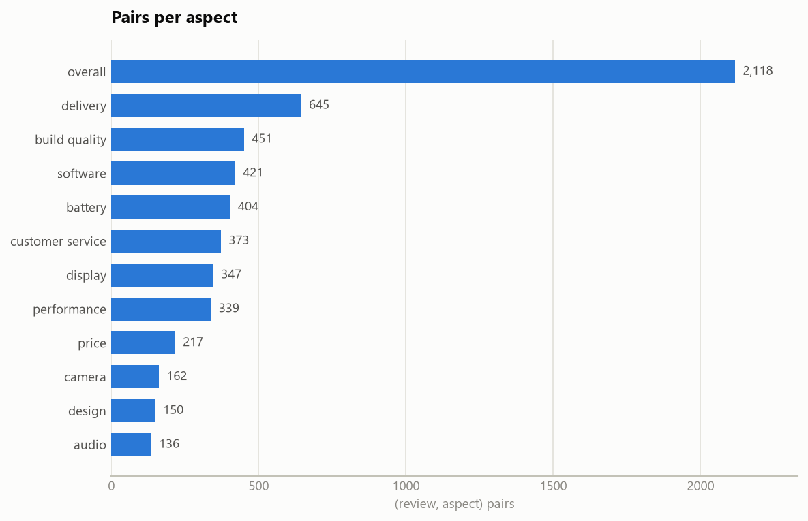
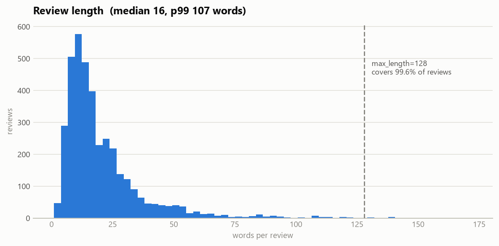
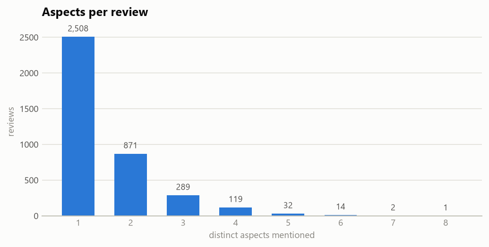

# Dataset

Everything about the data: where it came from, why it was chosen over the
alternatives, what was done to it, and what is wrong with it.

---

## 1. Selection

The application needs, for each review, **which aspects are discussed and the
sentiment toward each**. That requirement rules out most public sentiment data
immediately: it needs aspect **categories** (`camera`, `battery`), not just
aspect **spans** ("the camera"), and certainly not just a star rating.

| Dataset | Source | English size | Aspect categories? | Verdict |
|---|---|---|---|---|
| **M-ABSA** | [GitHub](https://github.com/swaggy66/M-ABSA) · [EMNLP 2025](https://aclanthology.org/2025.emnlp-main.128/) | 14,776 sentences / 21,017 triplets across 7 domains | **Yes** — term + category + polarity | **Selected** |
| SemEval-2014 Task 4 | [QCRI](https://alt.qcri.org/semeval2014/task4/) | ~6,500 sentences | Restaurant only; **laptop split has none** | Rejected |
| ABSA-QUAD (Rest15/16) | [GitHub](https://github.com/IsakZhang/ABSA-QUAD) | 3,204 sentences | Yes (quads) | Rejected — restaurants only, too small |
| Amazon Reviews (McAuley / Kaggle) | UCSD, Kaggle | Millions | **No — star rating only** | Rejected *as a label source* — but see §1b |
| SetFit-ABSA SemEval | [HF](https://huggingface.co/datasets/tomaarsen/setfit-absa-semeval-laptops) | ~3,000 | No — spans only | Rejected |
| OATS-ABSA | [HF](https://huggingface.co/datasets/jordiclive/OATS-ABSA) | ~4,000 | Yes (quads) | Backup |

**Why M-ABSA won**

1. It has a **`phone` domain** — the product category this project targets.
2. Annotations are already `(term, category, polarity)`, so transformation is
   mapping, not invention.
3. **100% of aspect terms appear verbatim in the review text** (verified across
   all 4,810 phone triplets), which leaves the door open to span highlighting.
4. Peer-reviewed at EMNLP 2025 — defensible provenance, not an unattributed CSV.
5. **Zero duplicate sentences** within the raw files.

**Why the Amazon corpora were rejected** — they are far larger, and that is the
trap. With only star ratings, aspect labels would have to be manufactured
(keyword rules, or an LLM labelling its own training data). The resulting metric
would measure agreement with the label-generator, not with reality.

### Licensing

M-ABSA's repository **ships no LICENSE file**. Consequently:

- Raw data is **not committed**. `scripts/download_data.py` fetches it into
  `data/raw/` (gitignored) on demand.
- `CITATION.bib` is written next to the data so provenance travels with it.
- Only the **English** splits are used. The other 20 languages are machine
  translated with human review, which adds a translation-artefact confound this
  project has no reason to take on.

---

## 1b. A second corpus, for a different job

M-ABSA supplies **labels**. It has no product identity — its rows are sentences,
not reviews of a named phone — so it cannot answer "which phone should I buy".
The recommender needs reviews attached to products.

So there are two corpora, and they are never confused:

| | M-ABSA | Amazon Cell Phones |
|---|---|---|
| Supplies | aspect + polarity **labels** | product **identity** |
| Used for | training and evaluating the models | scoring, never training |
| Size | 4,227 sentences, 5,859 pairs | 67,986 reviews, 720 listings |
| Licence | none published | **CC0 1.0** |

**Amazon Cell Phones Reviews**, Griko Nibras —
[Kaggle](https://www.kaggle.com/datasets/grikomsn/amazon-cell-phones-reviews) ·
[scraper source](https://github.com/grikomsn/amazon-cell-phones-reviews).
Scraped 2019-12-26.

Two properties made it the choice over larger alternatives:

1. **CC0 1.0 public domain**, verified from the LICENSE file in the source
   repository rather than taken from the Kaggle page. The larger
   `masaladata/14M` set publishes no licence at all, which rules out
   redistribution and reuse.
2. **No credentials required.** Kaggle's download endpoint serves it
   unauthenticated — verified, not assumed. A dataset behind an API token
   cannot run in CI or be reproduced by a reader.

Rejected alternatives: `masaladata/14M` (no licence, auth wall), a Flipkart set
(non-commercial licence, 62% duplicate review text, median 10 words),
`sergionefedov` (synthetic — it ships `true_quality` and `fake_rate` columns).

### It carries no aspect labels, and none are invented

The Amazon corpus is **only ever scored**, never trained on. Manufacturing
aspect labels for it — with a keyword list, or with the model's own output — is
exactly how a project ends up measuring its own label generator. Every metric in
[model.md](model.md) comes from M-ABSA's held-out split; the Amazon corpus is
evaluated instead by [reliability](recommender.md), which asks whether the
resulting per-phone scores are stable rather than whether they match a label
that was never collected.

### What the corpus is like

| | |
|---|---|
| Reviews | 67,986 across 720 listings |
| Era | 64% from 2018–19; 411 listings have a median review year of 2019 |
| Length | median 23 words, mean 55, p90 124 |
| Punctuation | **76.2% contain a sentence terminator** — the other 23.8% are where sentence splitting cannot help |
| Ratings | bimodal: 55.5% five-star, 18.7% one-star |
| Verified | 90.1% |
| Listed price | present for 82.8% (124 of 720 listings have none) |
| Brands | Samsung 346 · Motorola 105 · Apple 63 · Xiaomi 46 · Nokia 44 · Google 38 |

Samsung is nearly half the catalogue, which is a real skew: conclusions about
"phones" here are disproportionately conclusions about Samsung phones.

### Listings are not models

720 listings collapse to **364 phones**. The Galaxy Note 5 alone appears 19
times, differing only by colour, storage, carrier and condition. Left unmerged
the recommender shows one phone nineteen times and splits its reviews nineteen
ways, so none accumulates enough evidence for a stable profile.

[`ml/catalog/normalise.py`](../ml/catalog/normalise.py) does the merging, and it
**under-merges by design**. Splitting one phone across two entries costs
statistical power; pooling two different phones into one is silently wrong. So a
title that reduces to nothing but its brand is treated as a *failure* and
excluded — 17 listings, 844 reviews. Pooling those produced one fictitious
"Nokia" holding 692 reviews from eight different handsets.

Duplicate reviews are removed on `(model, reviewer name, body)`. Body alone was
too aggressive: "Great phone" occurs 222 times from 186 different reviewers.

---

## 2. Raw format

One review per line:

```
Camera quality not well. battery life not as per specificaction.####[['Camera quality', 'Camera#General', 'negative'], ['battery life', 'Battery/Longevity#Battery Life', 'negative']]
```

Left of `####` is the text; right is a Python literal list of
`[aspect_term, aspect_category, polarity]`. Parsed with `ast.literal_eval`,
never `eval` — a malformed or hostile line cannot execute anything
(there is a test for this).

### The taxonomy problem

The two electronics domains use **completely different label schemes**:

| | Scheme | Fine categories | Example |
|---|---|---|---|
| `phone` | e-commerce | 86 | `Battery/Longevity#Battery Life` |
| `laptop` | SemEval-2014 | 108 | `BATTERY#OPERATION_PERFORMANCE` |

They share **zero** entity labels. Merging them requires an explicit mapping —
that is [`ml/config/aspect_taxonomy.yaml`](../ml/config/aspect_taxonomy.yaml).
Collapsing is also necessary on its own terms: **41 of the 86 phone categories
have fewer than 30 examples**, far too sparse to learn or to evaluate honestly.

Both schemes map onto **12 shopper-recognisable aspects**: `overall`,
`delivery`, `build_quality`, `battery`, `customer_service`, `display`,
`software`, `performance`, `price`, `camera`, `design`, `audio`.

#### Mapping reads the whole label, not just the entity

Every label is `ENTITY#ATTRIBUTE`, and the first version of this mapping used
only the entity. That was **a bug**, and an invisible one: nothing crashed, no
metric moved sharply, and the aspect table still looked reasonable.

What it did:

* All **116 `LAPTOP#PRICE`** rows — "great machine for the price" — were filed
  under `overall`, because the entity is `LAPTOP`.
* `DISPLAY#PRICE` and `HARD_DISC#PRICE` ("you can't beat the storage for the
  price") were scattered into `display` and `performance`.
* Every `LAPTOP#*` row landed in `overall` whatever its attribute, including
  319 `LAPTOP#OPERATION_PERFORMANCE` rows that are plainly about speed.

The net effect was a `price` class trained on **phone data only**, and an
`overall` class inflated with opinions that belonged elsewhere.

Mapping now applies three rules in order:

| # | Rule | Applies when |
|---|---|---|
| 1 | `attribute_overrides` — the attribute wins | The attribute names an aspect the entity does not. **Only `PRICE` qualifies.** |
| 2 | `product_attribute_map` — the attribute decides | The entity *is* the whole product (`LAPTOP`), so it carries no aspect information |
| 3 | Entity map, attribute discarded | Everything else |

Rule 1 is deliberately narrow. `DISPLAY#QUALITY` and `CPU#OPERATION_PERFORMANCE`
are genuinely *about* the display and the CPU, so promoting `QUALITY` or
`OPERATION_PERFORMANCE` would empty the component aspects into two catch-alls.
Rule 2's residual attributes (`GENERAL`, `DESIGN_FEATURES`, `USABILITY`,
`MISCELLANEOUS`) stay at `overall` because sampling found no coherent aspect in
them — three consecutive draws from `LAPTOP#DESIGN_FEATURES` gave "it felt
flimsy", "enough power to multi-task" and "won the display roulette".

**phone/en needed no override.** Checked across all 4,810 phone triplets,
`#Price` and `#Value for Money` occur under the `Price` entity and nowhere
else, so rule 3 alone already handled it.

What the fix moved (mapped pairs, before splitting):

| Aspect | Before | After | Change | % positive before → after |
|---|---:|---:|---:|---|
| `performance` | 339 | **611** | **+272** | 45.4% → 54.2% |
| `price` | 217 | **341** | **+124** (+57%) | 90.8% → 85.6% |
| `build_quality` | 453 | **531** | +78 | 57.6% → 56.5% |
| `design` | 150 | **179** | +29 | 66.7% → 71.5% |
| `display` · `software` · `customer_service` | — | — | −2 each | their `#PRICE` rows left |
| `overall` | 2,130 | **1,728** | **−402** | 73.5% → 76.4% |

`battery`, `camera`, `delivery` and `audio` are unchanged: none of their
entities carries a `PRICE` attribute.

It did **not** fix the `price` class imbalance — price remains **85.6%
positive**, down from 90.8%. A sentiment-derived Price score therefore cannot
discriminate between phones, which is why the recommender's Price axis is
driven by listed price instead. See [`docs/model.md`](model.md).

Three entities are deliberately dropped, listed explicitly in the YAML so
the loader can tell "intentionally excluded" from "unrecognised" and **raise on
the latter**:

| Dropped | Why |
|---|---|
| `Product Accessories` (phone) | Bundled extras (cases, screen films), not the product |
| `OPTICAL_DRIVES` (laptop) | 4 examples |
| `Out_Of_Scope` (laptop) | Explicit non-aspect marker |

---

## 3. Cleaning

Cleaning sentiment text is mostly an exercise in restraint. Standard NLP
"cleaning" destroys the signal ABSA depends on, so the following are
**deliberately preserved**:

| Kept | Why |
|---|---|
| Negations (`not`, `no`, `never`) | They invert polarity — "not bad" is positive. Most stopword lists would delete these. |
| Punctuation `!` `?` | Carries intensity |
| Capitalisation | Carries emphasis ("BATTERY LIFE IS TERRIBLE") |
| Stopwords generally | `but` and `however` mark contrast, which is where multi-aspect reviews pivot |

Only non-language is removed — see [`ml/preprocessing/clean.py`](../ml/preprocessing/clean.py):

| Removed / normalised | Rationale |
|---|---|
| Scraper boilerplate | `"Your browser does not support HTML5 video"` is genuinely in the data |
| HTML tags, HTML entities | Markup, not language |
| Mojibake (`’` → `'`) | UTF-8 mis-decoded as cp1252 |
| Curly quotes, en/em dashes | **NFKC does not fold these**, so `don't` and `don’t` would be two tokens for every contraction. Folded explicitly. |
| U+FFFD | Residue of a failed decode; never meaningful |
| URLs / e-mails | Replaced with `[URL]` / `[EMAIL]`, not deleted — deleting would leave sentences ungrammatical |
| Runs of 3+ identical punctuation | Collapsed to 2, which preserves the emphasis without creating rare tokens |

---

## 4. Transformation

```
parse → clean → map categories → dedupe triplets → majority-vote polarity → group + split
```

**Duplicate triplets.** M-ABSA repeats identical triplets on ~3.5% of phone
rows. **449 were removed**; without this, a duplicated annotation would
out-vote a genuine disagreement.

**Polarity aggregation.** One review may carry several triplets for the same
aspect ("the screen is bright" + "the screen scratches"). These collapse to one
`(review, aspect)` row by majority vote. On a tie, the tie-break picks **only
among labels that were actually annotated** — a positive/negative tie resolves
to `negative`, never to `neutral`. Inventing a label no annotator assigned is
exactly the kind of fabrication that makes a headline metric meaningless.
**188 ties** were resolved this way.

**Two output datasets:**

| File | Task | Shape |
|---|---|---|
| `asc_{split}.csv` | Aspect Sentiment Classification | one row per `(review, aspect)`, 3-class target |
| `acd_{split}.csv` | Aspect Category Detection | one row per review, 12 binary columns |

---

## 5. Leakage prevention

This is the most important section in this document.

One review yields ~1.5 `(review, aspect)` rows. **Splitting at row level puts
sentences from the same review on both sides of the train/test boundary**, and
the model then scores well by recognising text it has already read. This is the
single most common reason a portfolio ABSA project reports 99%.

Two defences, both **enforced rather than assumed**:

1. **Group by review id** — every row from one review lands in one split.
2. **Group by normalised text** (casefolded, punctuation-stripped) — M-ABSA's
   own splits contain the same review text under different ids.

Measured on this build: **14 duplicate-text groups**, of which **8 spanned
splits**. The whole group is reassigned to the highest-priority split
(`test` > `dev` > `train`, so the evaluation set stays intact) and collapsed to
one review; **18 rows** were dropped as duplicates.

`assert_no_leakage()` then re-checks and **raises**. It is an assertion, not a
repair step: if it ever fires, the pipeline above it is wrong and any metric
downstream is invalid. It runs in `scripts/build_dataset.py` and in the test
suite.

---

## 6. Final dataset

| Metric | Value |
| --- | --- |
| Reviews | 3,836 |
| (review, aspect) pairs | 5,859 |
| Aspects | 12 |
| Mean aspects per review | 1.50 |
| Max aspects on one review | 8 |
| Review length | median 16 words, p90 40, p99 107, max 172 |
| Domains | phone 3,418 · laptop 2,441 pairs |

| Split | Pairs | Reviews |
|---|---:|---:|
| train | 3,518 | 2,298 |
| dev | 848 | 573 |
| test | 1,493 | 965 |

### Polarity

| Class | Pairs | Share |
|---|---:|---:|
| positive | 3,948 | 67.4% |
| negative | 1,606 | 27.4% |
| **neutral** | **305** | **5.2%** |

### Per aspect




| Aspect | Pairs | % negative |
|---|---:|---:|
| overall | 1,718 | 20.6% |
| delivery | 645 | 13.2% |
| performance | 610 | 37.0% |
| build_quality | 529 | 38.8% |
| software | 419 | 36.8% |
| battery | 404 | 35.4% |
| customer_service | 371 | 33.2% |
| display | 345 | 31.3% |
| price | 341 | 11.7% |
| design | 179 | 23.5% |
| camera | 162 | 33.3% |
| audio | 136 | 52.9% |

**5,859 pairs total.** `price` at 11.7% negative is the flattest class in the
set — see the note on the Price axis above.





---

## 7. Limitations

Stated plainly, because they shape what the metrics can mean.

1. **Small.** 5,859 pairs is modest. Expect a transformer's advantage over a
   TF-IDF baseline to be real but not dramatic, and expect run-to-run variance —
   evaluation should be seed-averaged.
2. **`neutral` is only 5.2%** (305 pairs). Per-class F1 for neutral will be the
   weakest number in the report. **Accuracy is not a valid selection metric
   here**; macro F1 is.
3. **`overall` dominates** at 29% of pairs — down from 37% since the mapping
   fix moved 402 pairs out of it. A model can still look competent while being
   poor at the twelve aspects users actually care about, hence per-aspect
   reporting.
4. **Tail aspects are thin.** `audio` (136), `camera` (162) and `design` (179)
   will have wide confidence intervals.
5. **`price` is near-degenerate.** 88.3% of price pairs are non-negative, and
   only 40 of 341 are negative. This is a property of the source data, not of
   the mapping: annotators record price complaints far less often than praise.
   A model can score well here by always answering "positive", so the
   recommender does not use sentiment for its Price axis.
5. **Coverage gap between domains.** `laptop` carries no `price` or `camera`
   labels, so those two aspects come from `phone` only. A laptop review
   discussing price is unlabelled for it — a source of false negatives in
   aspect detection that no amount of modelling fixes.
6. **Reviews are short** (median 16 words), so the model will see few
   long, multi-clause reviews in training. Real pasted reviews may be longer.
7. **373 reviews were dropped** for carrying no usable aspect: 327 had zero
   annotations upstream, 46 had only drop-listed labels. Fully accounted for —
   no silent losses.
8. **Single annotation source.** No inter-annotator agreement figures are
   published per example, so label noise cannot be quantified here.

---

## 8. Reproducing

**Labels (M-ABSA):**

```bash
python scripts/download_data.py     # fetch raw M-ABSA (English phone + laptop)
python scripts/build_dataset.py     # clean, map, dedupe, split, assert no leakage
python scripts/run_eda.py           # stats + figures into docs/figures/
python -m pytest tests/ -q
```

**Product identity (Amazon), for the recommender:**

```bash
python scripts/download_phones.py   # 9 MB, CC0, no credentials
python scripts/build_catalog.py     # 720 listings -> 211 phones; seconds
python scripts/score_catalog.py     # 36,951 reviews; ~1 h on CPU, resumable
python scripts/build_profiles.py    # shrinkage + evidence; seconds
python scripts/evaluate_recommender.py   # the reliability gate
```

Only `score_catalog.py` is expensive. It writes per-review rows rather than
per-phone averages precisely so aggregation can be re-tried without rerunning
inference.

Verified reproducible: a fresh `git clone` followed by the commands above
produces **byte-identical** CSVs (md5-matched on all splits).

## Citation

```bibtex
@inproceedings{wu-etal-2025-mabsa,
    title     = {{M-ABSA}: A Multilingual Dataset for Aspect-Based Sentiment Analysis},
    author    = {Wu, ChengYan and Ma, Bolei and Liu, Yihong and Zhang, Zheyu and
                 Deng, Ningyuan and Li, Yanshu and Chen, Baolan and Zhang, Yi and
                 Xue, Yun and Plank, Barbara},
    booktitle = {Proceedings of EMNLP 2025},
    year      = {2025},
    url       = {https://aclanthology.org/2025.emnlp-main.128/}
}
```
